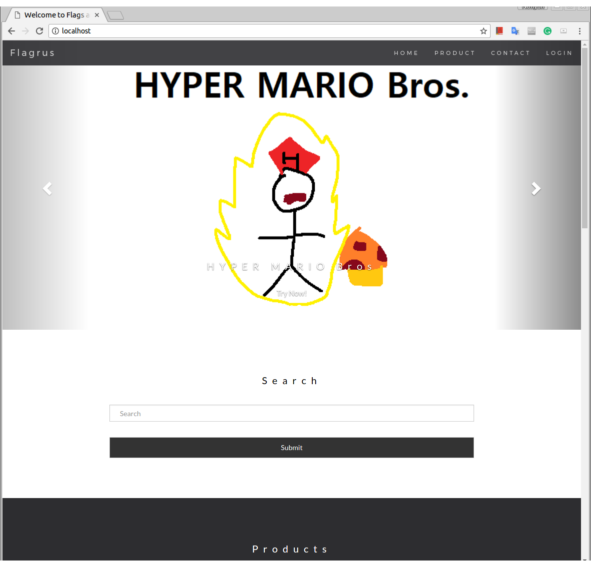
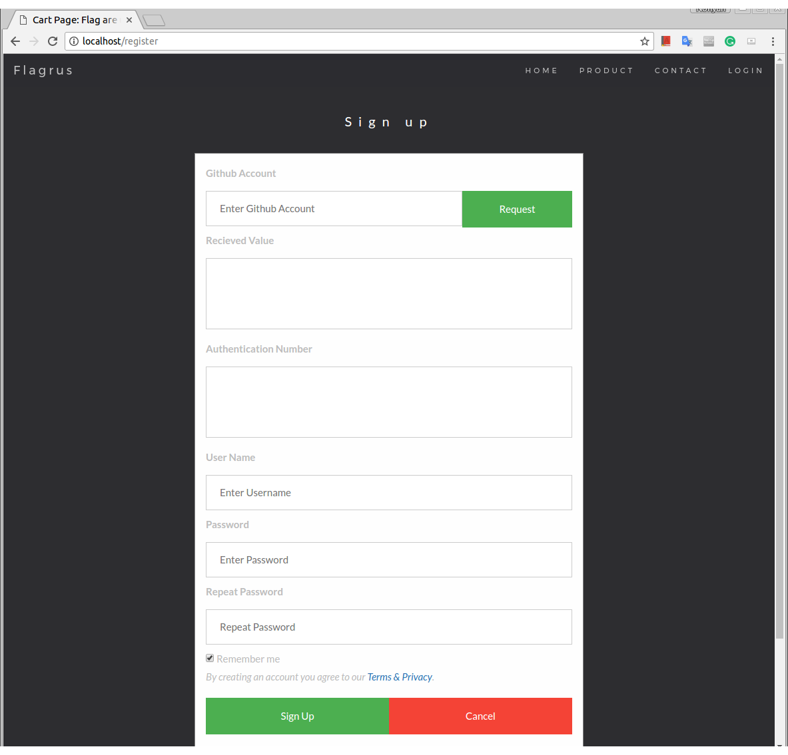
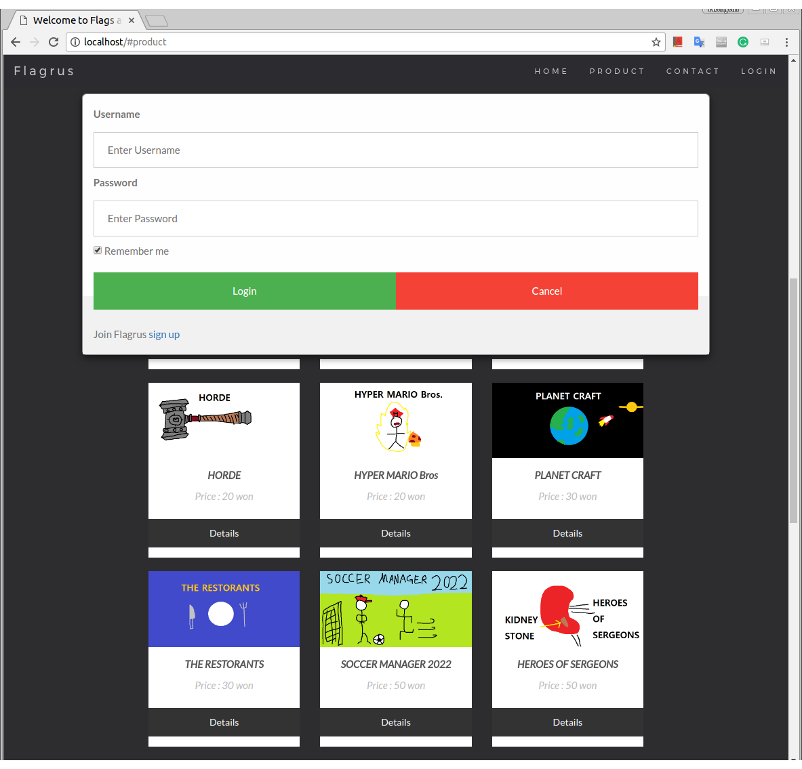
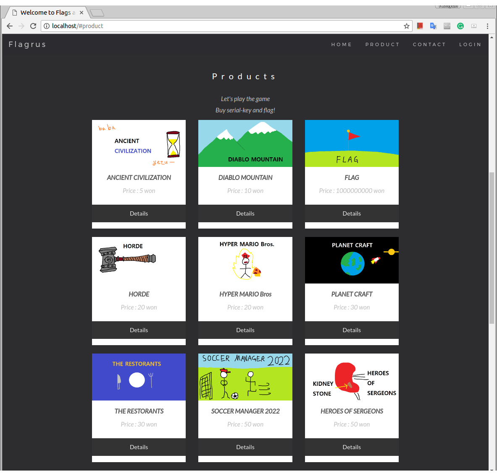
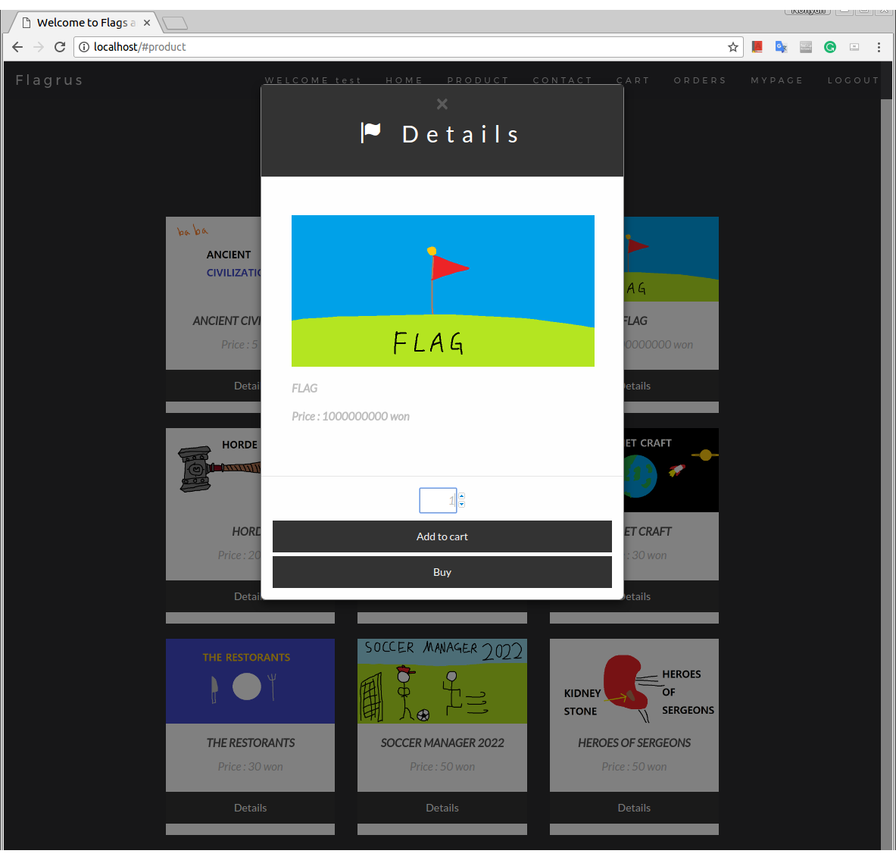
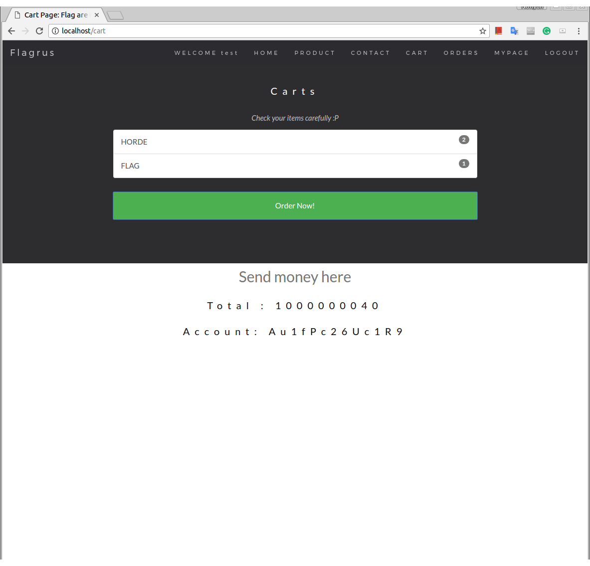
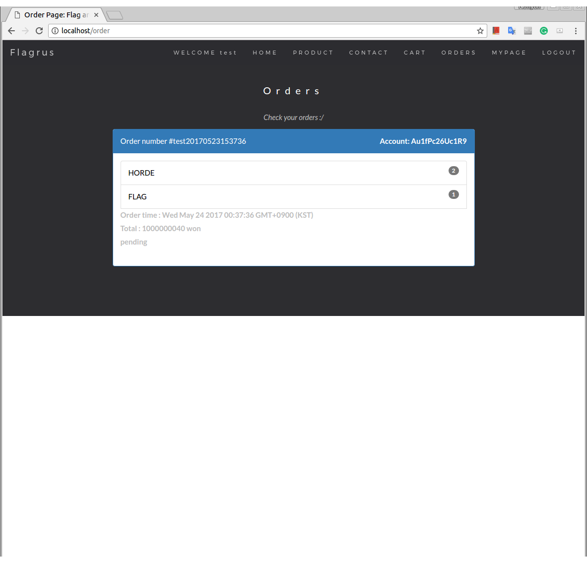
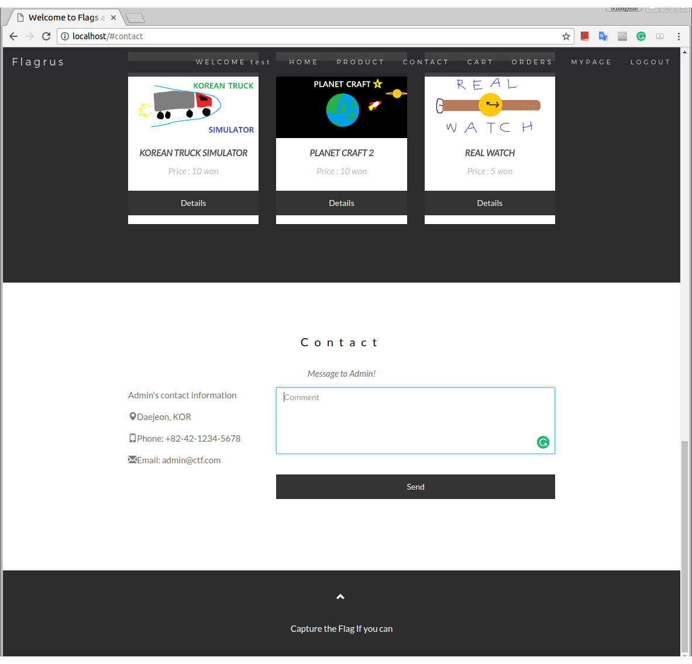

# TeamOne Shopping Mall
We developed shopping mall service by using `MySQL`, `GnuPG`, and `Express` framework on `Node.js`.

## Intro

Our shopping mall is web service, so we expect you can easily figure out how to use without any comment.
The following screen shot will be helpful to understand our service.

### Main page


### Sign-up page


### Log-in page


### Product page


### Detail item view


### Shopping cart page


### Order list


### Message to admin



## How to Use
### Download the source code and build it.
```
git clone https://github.com/KAIST-IS521/TeamTwo.git
cd TeamTwo
make
```

### Use your web browser to access our service.