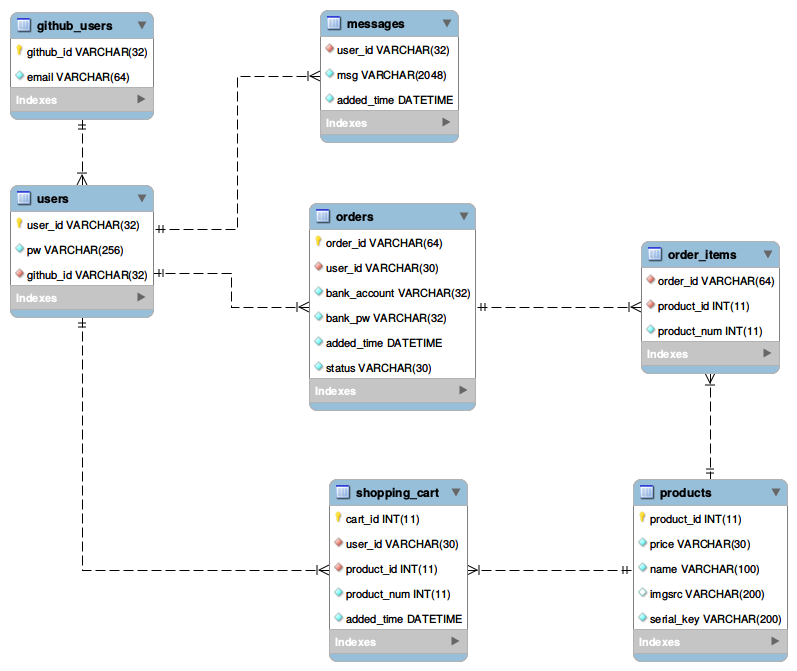

# Database

## EER diagram
This image is generated by MySQL workbench with the input of resetTable.sql.

## File info

### initalizeDB.sql
SQL queries in this file includes the creation of database tables and the initial data for installing.

### resetTable.sql
This file includes SQL queries for reseting database tables.

### insertData.sql
This file includes SQL queries for inserting the initial data.

